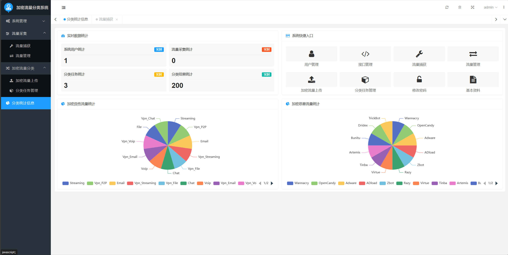
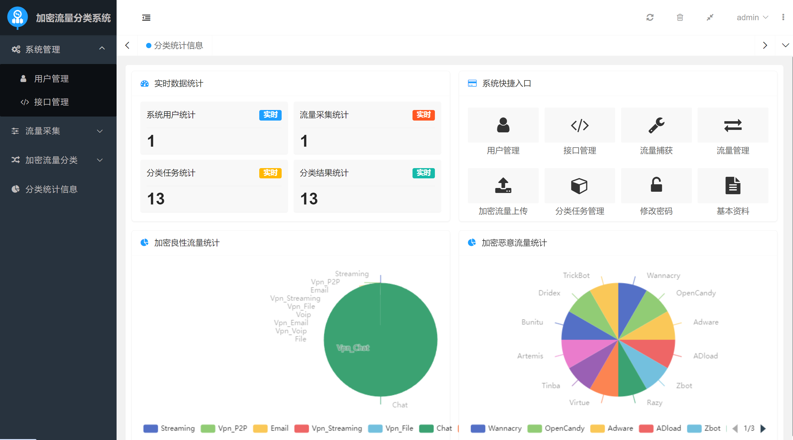

# 加密流量分类系统说明文档

##### 技术联系：Ai1763591756 索要完整系统的代码文件，可以远程调试






## 技术选型

1. 后端：

- `JDK 1.8`
- `Spring Boot`
- `Sa-Token`
- `Swagger`

2. 前端：

- `Layui`
- `Thymeleaf`
- `Freemarker`

3. 数据库：

- `MySQL 5.7`
- `MyBatis-Plus`

4. 网络抓包：`Pcap4J`
5. 调用`Windows Powershell`：`jPowerShell`
6. `HTTP`请求：`HttpClient`
7. 开发工具：`IntelliJ IDEA`、`Apache Maven`、`Navicat`、`Postman`

## 代码结构

```
├─jar // 可执行 JAR 包
├─scripts
│  └─preproccess // 数据预处理脚本
├─sql // 数据库 SQL 文件
└─src
    └─main
        ├─java
        │  └─com
        │      └─company
        │          └─encryptedtrafficclassifier
        │              ├─common // 公共资源
        │              │  ├─configs // 全局配置
        │              │  ├─constants // 通用常量
        │              │  ├─enums // 通用枚举
        │              │  ├─handlers // 通用处理器
        │              │  ├─modules // 功能模块（数据预处理模块、任务调度模块、分类模块）
        │              │  └─utils // 通用工具
        │              ├─controller // 控制器层
        │              ├─entity // 实体层
        │              ├─mapper // 数据持久层
        │              └─service // 业务逻辑层
        └─resources
            ├─static // 静态资源
            │  ├─css // CSS 代码
            │  ├─images // 图片资源
            │  └─js // JavaScript 代码
            └─templates // HTML 模板
```

## 数据库设计

1. `user`表：系统用户。
2. `traffic`表：自动采集的流量（流量文件、过滤规则）。
3. `task`表：分类任务（处理前文件、类型、执行状态）。
4. `result`表：分类结果（处理后文件、类别、置信度）。

## 使用说明

1. 创建数据库`encrypted_traffic_classifier`并导入`sql`目录下的数据脚本`encrypted_traffic_classifier.sql`。
2. 导入项目至`IntelliJ IDEA`，等待`Apache Maven`自动导入项目所需的依赖。
3. 在`src/main/resources`目录下修改`application.yml`配置文件中的数据源部分，修改`spring.datasource.url`、`spring.datasource.username`
   、`spring.datasource.password`，分别为数据库地址、账户和密码。
4. 修改`src/main/java/com/company/encryptedtrafficclassifier/common/constants/SystemConstant.java`文件中的`FLASK_SERVER_IP`
   为本地`Flask`服务端的地址。
5. 运行`src/main/java/com/company/encryptedtrafficclassifier/EncryptedTrafficClassifierApplication.java`启动系统。
6. 或者终端切换到`jar`目录下输入命令`java -jar encrypted-traffic-classifier-0.0.1-SNAPSHOT.jar`启动系统。
7. 打开浏览器，输入`http://localhost:8888`，点击注册新用户，注册成功后登录系统进行操作。

## 大文件调用PowerShell超时解决方案

修改`src/main/java/com/company/encryptedtrafficclassifier/common/modules/SystemDataPreprocessor.java`文件中的第`80`到`84`行：
```
if (task.getType().equals("0")) {
    config.put("maxWait", "20000");
} else {
    config.put("maxWait", "300000");
}
```
`maxWait`是超时参数，`PowerShell`执行超过这个时间会自动终止，所以觉得要跑几百兆的大文件就修改相应的超时时间，单位为毫秒，代码中`0`对应的良性任务`maxWait`设置的是`20`秒，`1`对应的恶性任务`maxWait`设置的是`300`秒。